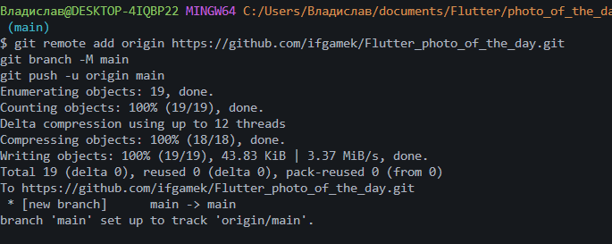

###### Асинхронность в Dart и Flutter

#### Ульянов Владислав ИСП-243

### flutter 3.47.2, dart 3.13.2, Edge, http

## 

# Запуск

- Скачать папку с проектом
- Перейти в папку cd
- Запустить проект flutter run -d Edge

# что изучили

| Концепция                       | Описание                                                           |
| :------------------------------ | :----------------------------------------------------------------- |
| **`Future<T>`**                 | Объект-обещание: вернёт значение типа `T` в будущем                |
| **`async`**                     | Помечает функцию как асинхронную, разрешает использовать `await`   |
| **`await`**                     | Приостанавливает функцию до завершения `Future`, не блокируя поток |
| **`try/catch`**                 | Перехватывает ошибки в асинхронном коде                            |
| **`http.get()`**                | Отправляет GET-запрос и возвращает `Future<Response>`              |
| **`jsonDecode()`**              | Парсит JSON-строку в `Map` или `List`                              |
| **`CircularProgressIndicator`** | Виджет-крутилка, индикатор загрузки                                |
| **`Image.network()`**           | Загружает и отображает картинку по URL                             |
| **`ChoiceChip`**                | Виджет для выбора одного варианта из нескольких                    |

# ответы на вопросы

1. Future<T>
   Обещание вернуть значение типа T в будущем. Отличие: обычное значение доступно сразу, Future — только после завершения асинхронной операции (через await).

2. await
   Ждёт завершения Future, приостанавливая текущую функцию. Поток не блокирует — UI продолжает работать.

3. setState() дважды
   1-й — показать загрузку (\_isLoading = true).
   2-й — скрыть загрузку и показать данные.

4. Без скобок
   \_fetchPhoto — передача ссылки на функцию (вызовется при нажатии).
   \_fetchPhoto() — немедленный вызов при построении виджета.

5. Image.network() vs Image.asset()
   network — грузит из интернета по URL (нужна сеть).
   asset — грузит из локальных файлов проекта (работает офлайн).
